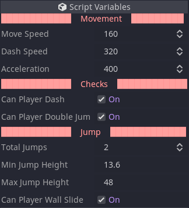

# Godot Export Categories

A very hacky way to separate script variables in categories.

This is not optimized at all, it's just something I put together to help me
separate my `Script Variables` into "sections".

If it helps you too, awseom! :grin:

Feel free to edit, contribute, share, do whatever you want with this.

It's for everyone and it is free!

## Instalation

Just copy the `export_categories` folder into your project's `addons` folder.

Or copy the whole `addons` folder and paste it into your project's folder.
