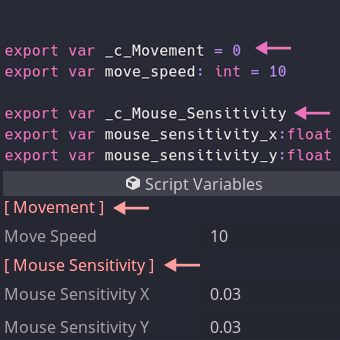

# Godot Export Categories

A very hacky way to separate script variables in categories.



This is not optimized at all, it's just something I put together to help me
separate my `Script Variables` into "sections".

If it helps you too, awseom! :grin:

Feel free to edit, contribute, share, do whatever you want with this.

It's for everyone and it is free!

## Instalation

Just copy the `export_categories` folder into your project's `addons` folder.

Or copy the whole `addons` folder and paste it into your project's folder.

Then just enable it on
`Project > Project Settings > Plugins > ExportCategories`.

## Usage

Export a var (of any type, if you want) with the `_c_` prefix. That's it.

Examples:

```javascript
export var _c_movement
export var move_speed = 100
// or
export var _c_dash: int
export var dash_speed: int = 150
```

All variables prefixed with `_c_` will be turned into a red label.

Enjoy
